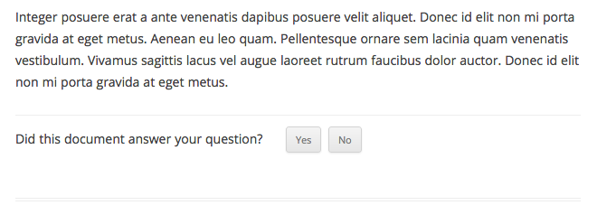
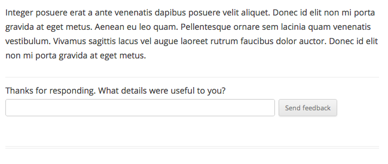
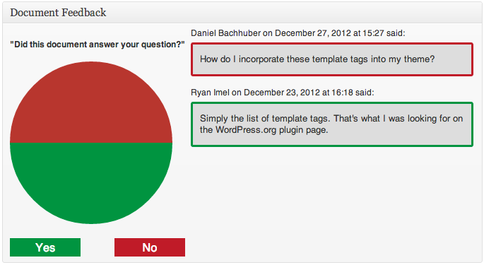

# Document Feedback

Close the loop — get feedback from readers on the documentation you write.

Document Feedback appends a simple feedback form to Pages (or other post types that you specify). Readers are asked whether the document answered their question or not.

If the reader indicates "Yes", they'll be asked about which details were useful to them. If the reader indicates "No", they'll be prompted to respond with which details they hoped to see.

Feedback is emailed to the post author, and summarized in a post meta box in the admin.

If you'd like to check out the code and contribute, [join us on GitHub](https://github.com/Automattic/Document-Feedback). Pull requests are more than welcome!

## Installation

Here's the low-down on how you can get up and running:

1. Upload the `document-feedback` folder to your plugins directory (e.g. `/wp-content/plugins/`).
2. Activate the plugin through the 'Plugins' menu in WordPress.
3. Document feedback functionality is automatically appended to Pages by default.
4. (Optionally) Modify the prompt text using a filter.

## Screenshots

A feedback prompt is automatically appended to every Page. These prompts can be modified with a filter.

---

If a user submits feedback, they'll be asked to clarify their feedback. These responses are emailed to the post author.

---

All feedback is summarized in a post meta box on the Page edit screen.

## Frequently Asked Questions

There aren't any frequently asked questions yet. Why not [ask one in the forums](http://wordpress.org/support/plugin/document-feedback)?

## Changelog

### 1.3 (Feb. 18, 2013)
* New Simplified Chinese localization. Thanks [sparanoid](https://github.com/sparanoid)

### 1.2 (Jan. 29, 2013)
* New Bulgarian localization. Thanks [mpeshev](https://github.com/mpeshev)
* New Italian localization. Thanks [milesimarco](https://github.com/milesimarco)

### 1.1 (Jan. 8, 2013)
* New Turkish localization. Thanks [mustafauysal](https://github.com/mustafauysal).

### 1.0 (Dec. 27, 2012)
* Initial release
